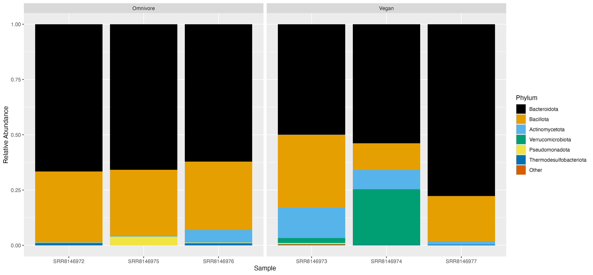
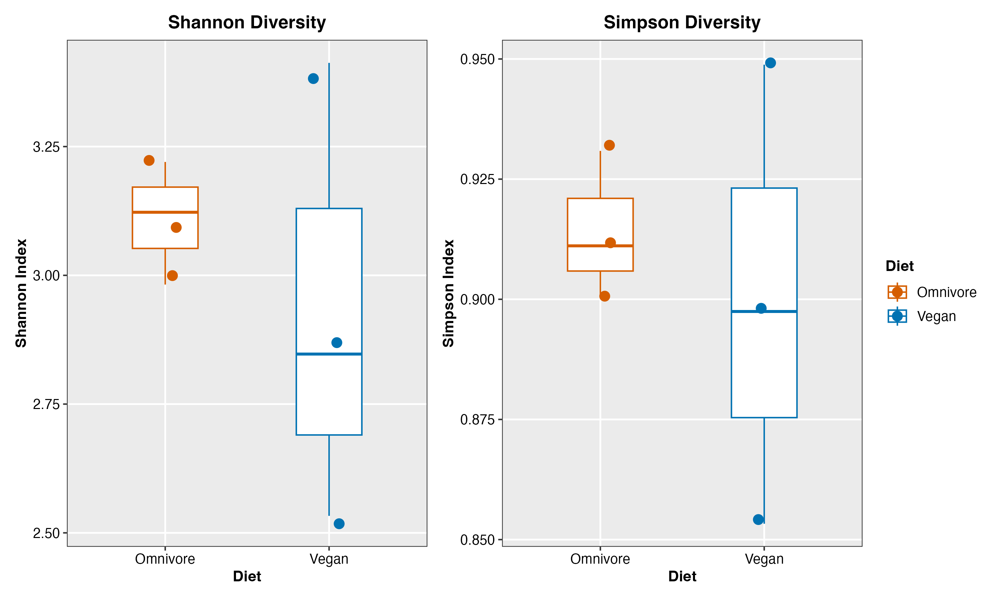
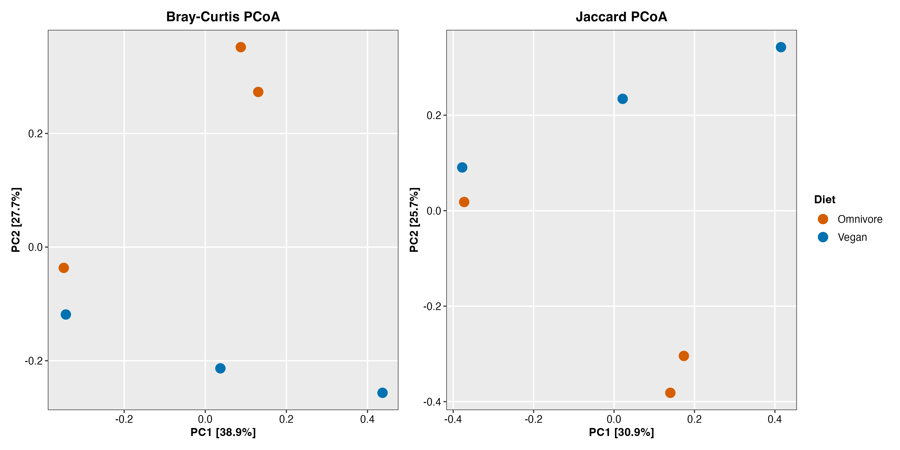
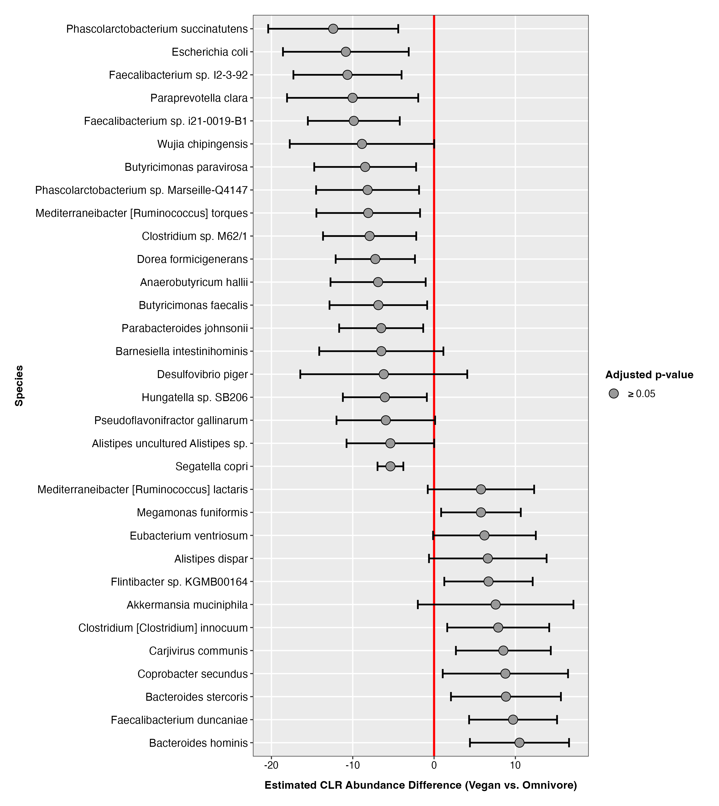

## Introduction
The human gut hosts a complex ecosystem of microbes that affects metabolism, immune function, and overall health. A key function of this microbiome is the fermentation of dietary fiber into short-chain fatty acids (SCFAs), including acetate, propionate, and butyrate, which help regulate energy metabolism, inflammation, and pathogen resistance.1 Diet is one of the primary determinant shaping microbial composition.2 Plant-rich diets tend to enrich fiber-fermenting bacteria like *Prevotella*, which is particularly associated with propionate production and favorable metabolic outcomes, while high animal protein and fat intake is consistently linked to *Bacteroides* dominance. However, the health effects of *Prevotella* are strain-dependent, with some strains promoting beneficial functions and others implicated in inflammation and insulin resistance, highlighing the importance of strain-level analysis in understanding gut health.1,2

Characterizing these communities has traditionally relied on 16S rRNA gene sequencing, which targets a specific marker gene present in all bacteria. While widely used, this approach detects only part of the microbial community, and introduces bias in 16S rRNA gene copy number among different bacteria that is not easily corrected. Shotgun metagenomics offers a more comprehensive alternative by sequencing all DNA present in a sample, providing greater power to identify less abundant taxa and enabling higher resolution analysis when a sufficient number of reads is available.3,4

Several computational tools exist for classifying the resulting data, each making different trade-offs between accuracy and speed. Alignment-based methods are among the most sensitive but computationally intensive, while marker-based methods are faster but restricted to predefined reference sequences and can introduce bias when markers are not evenly distributed among taxa of interest.5 Kraken2 offers a scalable alternative by matching sequence fragments against a reference database using a k-mer approach; however, ambiguity can arise among closely related taxa.6 Bracken addresses this by applying probabilistic re-estimation to refine species-level abundance estimates,6 and together this pipeline was selected for its computational efficiency and improved abundance quantification.5

To quantify microbial community differences, both alpha and beta diversity metrics were applied. Alpha diversity captures within-sample richness and evenness, while beta diversity describes compositional differences between samples, with PERMANOVA providing a formal non-parametric statistical test for group-level differences.7 For differential abundance analysis, ALDEx2 was selected due to its ability to handle the inherently compositional nature of sequencing data, estimating relative abundance through Monte Carlo sampling and controlling the false discovery rate via Benjamini-Hochberg correction.8,9

Shotgun metagenomic sequencing data from De Filippis et al.8 were reanalyzed here to characterize how gut microbial communities differ between vegan and omnivorous individuals, integrating taxonomic profiling, diversity metrics, and differential abundance testing.

## Methods
### Computational Resources
All command-line analyses were executed on the Digital Research Alliance of Canada's Nibi cluster via SLURM jobs. Downstream analyses were performed locally in R v4.5.1.
### Data Acquisition
Paired-end shotgun metagenomic sequencing reads from three vegans (SRR8146973, SRR8146974, SRR8146977) and three omnivores (SRR8146972, SRR8146975, SRR8146976) were downloaded from NCBI SRA (De Filippis et al.2) using prefetch and fasterq-dump `--split-files` from SRA Toolkit v3.0.9.
### Quality Control
Raw read quality was assessed using FastQC v0.12.1.10 Reads were trimmed using fastp v1.0.1 with `--detect_adapter_for_pe`, `--qualified_quality_phred 20` (99% base-calling accuracy), and `--length_required` 50 to exceed Kraken2's minimum k-mer size.11
### Taxonomic Classification
Trimmed reads were classified using Kraken2 v2.1.6 with `--paired` and a non-default `--confidence 0.15` to reduce false positives over the default of 0.6 Species-level abundance was refined using Bracken with `-r 300` matching the dataset read length and `-l S` for species-level output.12 Reports were converted to BIOM format using kraken-biom v1.2.0 with `--fmt json` for biomformat compatibility.13
### Diversity and Differential Abundance Analysis
The BIOM file was imported into phyloseq v1.54.2.14,15 Alpha diversity was assessed using Shannon and Simpson indices with Wilcoxon rank-sum testing. Beta diversity was evaluated using Bray-Curtis and Jaccard dissimilarity matrices with PERMANOVA via adonis2 (999 permutations).16 Differential abundance was tested using ALDEx2,17 with Benjamini-Hochberg false discovery rate correction. Visualizations were generated using ggplot2 v3.5.1.18.
## Results

**Figure 1. Phylum-level relative abundance of gut microbial communities in omnivore and vegan subjects.** Stacked bar plots showing the relative abundance of bacterial phyla in individual gut metagenome samples from omnivore (SRR8146972, SRR8146975, SRR8146976) and vegan (SRR8146973, SRR8146974, SRR8146977) subjects, processed using Kraken2 and Bracken. The six most abundant phyla are displayed individually; remaining phyla are collapsed into "Other." *Bacteroidota* and *Bacillota* dominated all samples regardless of diet. Vegan samples exhibited greater inter-individual variability, with SRR8146973 showing elevated Actinomycetota and SRR8146974 showing elevated Verrucomicrobiota.

**Figure 2. Alpha diversity of gut microbial communities stratified by diet group.** Within-sample microbial diversity compared between omnivore (orange, n=3) and vegan (blue, n=3) subjects using the Shannon index (left) and Simpson index (right). Each point represents one sample. Group differences were assessed using the Wilcoxon rank-sum test (Shannon: W=6, p=0.70; Simpson: W=6, p=0.70). Omnivore samples showed slightly higher and more consistent diversity by both indices, though differences were not statistically significant.

**Figure 3. Beta diversity ordination of gut microbial communities by diet group.** Principal Coordinates Analysis (PCoA) of gut microbial community composition in omnivore (orange, n=3) and vegan (blue, n=3) subjects, based on Bray-Curtis dissimilarity (left, PC1=38.9%, PC2=27.7%) and Jaccard dissimilarity (right, PC1=30.9%, PC2=25.7%). Group-level compositional differences were tested using PERMANOVA with 999 permutations (Bray-Curtis: R2=0.238, p=0.40; Jaccard: R2=0.227, p=0.30). No statistically significant separation between diet groups was observed under either dissimilarity measure.

**Figure 4. Differential abundance of gut microbial species between vegan and omnivore subjects estimated by ALDEx2.** Forest plot of estimated species-level centered log-ratio (CLR) abundance differences between vegan and omnivore subjects. Species with an absolute CLR difference greater than 5 are shown. Points represent the estimated effect size and horizontal bars represent within-group variance. Positive values indicate enrichment in vegans; negative values indicate enrichment in omnivores. No species reached statistical significance after Benjamini-Hochberg false discovery rate correction (all adjusted p ≥ 0.05).

## Discussion
This study characterized gut microbial communities in three omnivore and three vegan subjects using shotgun metagenomics, revealing compositional differences that, while not statistically significant, are directionally consistent with the broader literature on diet and the gut microbiome.

At the phylum level, all samples were dominated by *Bacteroidota* and *Bacillota*, consistent with the typical human gut microbiome.19 Vegan samples showed greater inter-individual variability, including notable enrichment of *Verrucomicrobiota* in one subject (Figure 1), likely reflecting elevated *Akkermansia muciniphila*, a mucin-degrading bacterium enriched in plant-based diet groups.20

Alpha diversity was slightly higher and more consistent among omnivores by both Shannon and Simpson indices, though not statistically significant (Shannon: W=6, p=0.70; Simpson: W=6, p=0.70; Figure 2). This aligns with Fackelmann et al.,20 who observed lower microbial richness in vegans and vegetarians relative to omnivores across 21,561 individuals, suggesting that the broader dietary variety of omnivores may support a wider range of gut taxa. Beta diversity analysis revealed no statistically significant separation between groups under either Bray-Curtis or Jaccard dissimilarity (Bray-Curtis: R²=0.238, p=0.40; Jaccard: R²=0.227, p=0.30; PERMANOVA, 999 permutations; Figure 3), which is expected given the small sample size.

Differential abundance analysis identified several biologically meaningful trends, though none reached statistical significance after Benjamini-Hochberg false discovery rate correction (Figure 4). Species trending higher in omnivores included *Mediterraneibacter* [*Ruminococcus*] *torques*, linked to mucosal inflammation and Inflammatory Bowel Disease (IBD) and identified as a signature omnivore microbe negatively correlated with cardiometabolic health,20,21 and *Escherichia coli*, consistent with its association with protein fermentation in the gut (Figure 4). Conversely, species trending higher in vegans included *Akkermansia muciniphila*, *Faecalibacterium duncaniae*, and members of the *Bacteroides* genus, consistent with their known association with plant-rich diets and fibre fermentation.20

With only three samples per group, all statistical tests lacked sufficient power, and the absence of significant results reflects this limitation rather than a true lack of biological differences. Nonetheless, the directional consistency between our results and large-scale studies supports the broader conclusion that vegan diets are associated with enrichment of taxa linked to fibre metabolism and favourable health outcomes, while omnivore microbiomes show enrichment of taxa associated with protein fermentation and inflammatory processes.2,20

## References
1.	Precup G, Vodnar DC. Gut Prevotella as a possible biomarker of diet and its eubiotic versus dysbiotic roles: a comprehensive literature review. British Journal of Nutrition. 2019 Jul;122(2):131–40. doi:10.1017/S0007114519000680 

2.	Filippis FD, Pasolli E, Tett A, Tarallo S, Naccarati A, Angelis MD, et al. Distinct Genetic and Functional Traits of Human Intestinal Prevotella copri Strains Are Associated with Different Habitual Diets. Cell Host & Microbe. 2019 Mar 13;25(3):444-453.e3. doi:10.1016/j.chom.2019.01.004 PubMed PMID: 30799264. 
3.	Madison JD, LaBumbard BC, Woodhams DC. Shotgun metagenomics captures more microbial diversity than targeted 16S rRNA gene sequencing for field specimens and preserved museum specimens. PLOS ONE. 2023 Sep 19;18(9):e0291540. doi:10.1371/journal.pone.0291540 
4.	Durazzi F, Sala C, Castellani G, Manfreda G, Remondini D, De Cesare A. Comparison between 16S rRNA and shotgun sequencing data for the taxonomic characterization of the gut microbiota. Sci Rep. 2021 Feb 4;11(1):3030. doi:10.1038/s41598-021-82726-y 
5.	Ye SH, Siddle KJ, Park DJ, Sabeti PC. Benchmarking Metagenomics Tools for Taxonomic Classification. Cell. 2019 Aug 8;178(4):779–94. doi:10.1016/j.cell.2019.07.010 
6.	Wood DE, Lu J, Langmead B. Improved metagenomic analysis with Kraken 2. Genome Biol. 2019 Dec 1;20(1):257. doi:10.1186/s13059-019-1891-0 
7.	Anderson MJ. A new method for non-parametric multivariate analysis of variance. Austral Ecology. 2001;26(1):32–46. doi:10.1111/j.1442-9993.2001.01070.pp.x 
8.	Fernandes AD, Reid JN, Macklaim JM, McMurrough TA, Edgell DR, Gloor GB. Unifying the analysis of high-throughput sequencing datasets: characterizing RNA-seq, 16S rRNA gene sequencing and selective growth experiments by compositional data analysis. Microbiome. 2014 Dec 1;2(1):15. doi:10.1186/2049-2618-2-15 
9.	Benjamini Y, Hochberg Y. Controlling the False Discovery Rate: A Practical and Powerful Approach to Multiple Testing. Royal Statistical Society Journal Series B: Methodological. 1995 Jan 1;57(1):289–300. doi:10.1111/j.2517-6161.1995.tb02031.x 
10.	hbctraining/Intro-to-rnaseq-hpc-salmon [HTML] [Internet]. Teaching materials at the Harvard Chan Bioinformatics Core; 2026 [cited 2026 Mar 22]. Available from: https://github.com/hbctraining/Intro-to-rnaseq-hpc-salmon 
11.	S C, Y Z, Y C, J G. fastp: an ultra-fast all-in-one FASTQ preprocessor. Bioinformatics (Oxford, England). 2018 Jan 9;34(17). doi:10.1093/bioinformatics/bty560 PubMed PMID: 30423086. 
12.	Lu J, Breitwieser FP, Thielen P, Salzberg SL. Bracken: estimating species abundance in metagenomics data. PeerJ Comput Sci. 2017;3:e104. doi:10.7717/peerj-cs.104 PubMed PMID: 40271438; PubMed Central PMCID: PMC12016282. 
13.	Dabdoub S. smdabdoub/kraken-biom [Python] [Internet]. 2026 [cited 2026 Mar 22]. Available from: https://github.com/smdabdoub/kraken-biom 
14.	McMurdie PJ, Holmes S. phyloseq: An R Package for Reproducible Interactive Analysis and Graphics of Microbiome Census Data. PLOS ONE. 2013 Apr 22;8(4):e61217. doi:10.1371/journal.pone.0061217 
15.	vegan: an R package for community ecologists [Internet]. [cited 2026 Mar 22]. Available from: https://vegandevs.github.io/vegan/ 
16.	Anderson MJ. Permutational Multivariate Analysis of Variance (PERMANOVA). In: Wiley StatsRef: Statistics Reference Online [Internet]. John Wiley & Sons, Ltd; 2017 [cited 2026 Mar 22]. p. 1–15. Available from: https://onlinelibrary.wiley.com/doi/abs/10.1002/9781118445112.stat07841 doi:10.1002/9781118445112.stat07841 
17.	Ad F, Jn R, Jm M, Ta M, Dr E, Gb G. Unifying the analysis of high-throughput sequencing datasets: characterizing RNA-seq, 16S rRNA gene sequencing and selective growth experiments by compositional data analysis. Microbiome. 2014 May 5;2. doi:10.1186/2049-2618-2-15 PubMed PMID: 24910773. 
18.	The Complete ggplot2 Tutorial - Part1 | Introduction To ggplot2 (Full R code) [Internet]. [cited 2026 Mar 23]. Available from: https://r-statistics.co/Complete-Ggplot2-Tutorial-Part1-With-R-Code.html 
19.	Turnbaugh PJ, Ley RE, Hamady M, Fraser-Liggett CM, Knight R, Gordon JI. The Human Microbiome Project. Nature. 2007 Oct;449(7164):804–10. doi:10.1038/nature06244 
20.	Fackelmann G, Manghi P, Carlino N, Heidrich V, Piccinno G, Ricci L, et al. Gut microbiome signatures of vegan, vegetarian and omnivore diets and associated health outcomes across 21,561 individuals. Nat Microbiol. 2025 Jan;10(1):41–52. doi:10.1038/s41564-024-01870-z 
21.	Qiu P, Ishimoto T, Fu L, Zhang J, Zhang Z, Liu Y. The Gut Microbiota in Inflammatory Bowel Disease. Front Cell Infect Microbiol. 2022 Feb 22;12. doi:10.3389/fcimb.2022.733992 

